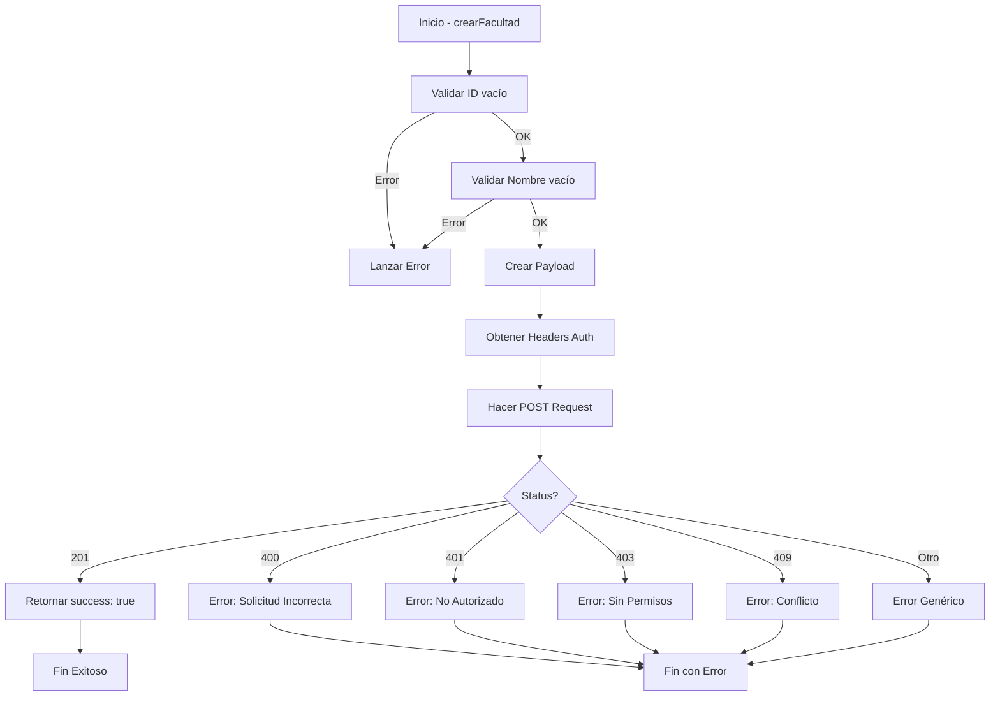

# Mapeo OpenAPI ↔ Implementación de Facultades

## 📋 Referencia del Endpoint

**URL Proporcionada:**
```
https://z6gasdnp5zp6v6egg4kg3jsitu0ffcqu.lambda-url.us-east-1.on.aws/docs#/Acad%C3%A9mico%20-%20Admin/create_faculty_api_v1_admin_academico_facultades_post
```

**Endpoint Local Implementado:**
```
POST http://localhost:8000/api/v1/admin/academico/facultades
```

---

## 📊 Mapa de Operaciones OpenAPI → Servicio

### 1. POST - Crear Facultad (Create)

#### OpenAPI Specification
```yaml
POST /api/v1/admin/academico/facultades
Summary: Create Faculty (Crear Facultad)
Tags: Académico - Admin
```

#### Request Body (OpenAPI)
```json
{
  "id_facultad": "FAC_ING",
  "nombre_facultad": "Ingenierías y Tecnologías"
}
```

#### Implementación en Servicio
```javascript
// Función
export const crearFacultad = async (datosFacultad)

// Parámetro esperado
{
  id_facultad: "FAC_ING",           // string, required
  nombre_facultad: "Ingenierías y Tecnologías"  // string, required
}

// Ejemplo de uso
const resultado = await FacultyService.crearFacultad({
  id_facultad: "FAC_ING",
  nombre_facultad: "Ingenierías y Tecnologías"
});
```

#### Response Success (201)
```json
{
  "status": "success",
  "message": "Facultad creada exitosamente",
  "data": {
    "id_facultad": "FAC_ING",
    "nombre_facultad": "Ingenierías y Tecnologías"
  }
}
```

#### Manejo en Servicio
```javascript
if (response.status === 201) {
  const data = await response.json();
  console.log('✅ Facultad creada:', data);
  return { success: true, data };
}
```

---

### 2. GET - Obtener Todas las Facultades (Read)

#### OpenAPI Specification
```yaml
GET /api/v1/admin/academico/facultades
Summary: Get All Faculties (Obtener todas las facultades)
Tags: Académico - Admin
```

#### Implementación en Servicio
```javascript
// Función
export const obtenerFacultades = async ()

// Sin parámetros

// Ejemplo de uso
const facultades = await FacultyService.obtenerFacultades();

// Retorna: Array de facultades
[
  {
    "id_facultad": "FAC_ING",
    "nombre_facultad": "Ingenierías y Tecnologías"
  },
  {
    "id_facultad": "FAC_ADM",
    "nombre_facultad": "Administración y Negocios"
  }
]
```

---

### 3. PUT - Actualizar Facultad (Update)

#### OpenAPI Specification
```yaml
PUT /api/v1/admin/academico/facultades/{id_facultad}
Summary: Update Faculty (Actualizar Facultad)
Tags: Académico - Admin
Parameters:
  - name: id_facultad
    in: path
    required: true
    schema:
      type: string
```

#### Request Body (OpenAPI)
```json
{
  "nombre_facultad": "Nuevo Nombre"
}
```

#### Implementación en Servicio
```javascript
// Función
export const actualizarFacultad = async (idFacultad, datosFacultad)

// Parámetros
idFacultad: "FAC_ING",        // ID en la ruta
{
  nombre_facultad: "Nuevo Nombre"  // solo el nombre es actualizable
}

// Ejemplo de uso
const resultado = await FacultyService.actualizarFacultad("FAC_ING", {
  nombre_facultad: "Ingenierías, Tecnologías y Ciencias"
});
```

#### Response Success (200)
```json
{
  "status": "success",
  "message": "Facultad actualizada exitosamente",
  "data": {
    "id_facultad": "FAC_ING",
    "nombre_facultad": "Ingenierías, Tecnologías y Ciencias"
  }
}
```

---

### 4. DELETE - Eliminar Facultad (Delete)

#### OpenAPI Specification
```yaml
DELETE /api/v1/admin/academico/facultades/{id_facultad}
Summary: Delete Faculty (Eliminar Facultad)
Tags: Académico - Admin
Parameters:
  - name: id_facultad
    in: path
    required: true
    schema:
      type: string
```

#### Implementación en Servicio
```javascript
// Función
export const eliminarFacultad = async (idFacultad)

// Parámetro
idFacultad: "FAC_ING"  // ID en la ruta

// Ejemplo de uso
const resultado = await FacultyService.eliminarFacultad("FAC_ING");

// Retorna
{ success: true }
```

#### Response Success (200)
```json
{
  "status": "success",
  "message": "Facultad eliminada exitosamente",
  "data": null
}
```

---

## ✅ Codes de Error Mapeados

| HTTP Code | OpenAPI Error | Implementación Servicio | Mensaje |
|-----------|---------------|------------------------|---------|
| 201 | Created | ✅ crearFacultad() | "Facultad creada exitosamente" |
| 200 | OK | ✅ obtenerFacultades(), actualizarFacultad(), eliminarFacultad() | - |
| 400 | Bad Request | ✅ Manejado | "Solicitud incorrecta" |
| 401 | Unauthorized | ✅ Manejado | "No autorizado: Debe iniciar sesión" |
| 403 | Forbidden | ✅ Manejado | "Sin permisos: No tiene permisos para crear facultades" |
| 404 | Not Found | ✅ Manejado | "No encontrada: La facultad no existe" |
| 409 | Conflict | ✅ Manejado | "Conflicto: La facultad ya existe" o "No se puede eliminar: la facultad tiene programas" |
| 422 | Unprocessable Entity | ✅ Manejado | "Error de validación: Los datos no son válidos" |

---

## 🔐 Autenticación

### OpenAPI Requirement
```yaml
security:
  - Bearer: []
```

### Implementación
```javascript
// En cada función
const headers = AuthService.getAuthHeaders();

// Headers enviados automáticamente
{
  "Authorization": "Bearer <JWT_TOKEN>",
  "Content-Type": "application/json"
}
```

---

## 📝 Request/Response Mapping

### Crear Facultad

#### OpenAPI Request
```
POST /api/v1/admin/academico/facultades HTTP/1.1
Host: localhost:8000
Authorization: Bearer <token>
Content-Type: application/json

{
  "id_facultad": "FAC_ING",
  "nombre_facultad": "Ingenierías y Tecnologías"
}
```

#### Servicio Request
```javascript
await fetch(`http://localhost:8000/api/v1/admin/academico/facultades`, {
  method: 'POST',
  headers: {
    "Authorization": "Bearer <token>",
    "Content-Type": "application/json"
  },
  body: JSON.stringify({
    id_facultad: "FAC_ING",
    nombre_facultad: "Ingenierías y Tecnologías"
  })
});
```

#### OpenAPI Response
```json
HTTP/1.1 201 Created
Content-Type: application/json

{
  "status": "success",
  "message": "Facultad creada exitosamente",
  "data": {
    "id_facultad": "FAC_ING",
    "nombre_facultad": "Ingenierías y Tecnologías"
  },
  "code": 201
}
```

#### Servicio Response
```javascript
{
  success: true,
  data: {
    status: "success",
    message: "Facultad creada exitosamente",
    data: {
      id_facultad: "FAC_ING",
      nombre_facultad: "Ingenierías y Tecnologías"
    },
    code: 201
  }
}
```

---

## 🎯 Validaciones Implementadas vs OpenAPI

| Validación | OpenAPI | Implementación | Detalles |
|-----------|---------|-----------------|----------|
| ID Requerido | ✅ required | ✅ Sí | Lanza error si vacío |
| Nombre Requerido | ✅ required | ✅ Sí | Lanza error si vacío |
| Formato ID | ✅ Especificado | ✅ Sí | A-Z, 0-9, _, - (3-50 chars) |
| Formato Nombre | ✅ string | ✅ Sí | Máx 255 caracteres |
| ID Único | ✅ (409) | ✅ Sí | Retorna error 409 si existe |
| Token Válido | ✅ Bearer | ✅ Sí | Valida autenticación |
| Permisos Admin | ✅ (403) | ✅ Sí | Valida permisos de admin |

---

## 🔄 Flujo Completo Implementado



---

## 💻 Instrucciones de Integración

### 1. Agregar Endpoint a Constants
```javascript
// src/utils/constants.js
export const API_ENDPOINTS = {
  // ... otros endpoints
  FACULTADES: `${API_BASE_URL}/api/v1/admin/academico/facultades`,
  FACULTAD_BY_ID: (id) => `${API_BASE_URL}/api/v1/admin/academico/facultades/${id}`,
};
```

✅ **COMPLETADO** en constants.js

### 2. Crear Servicio
```javascript
// src/Services/CreateFaculty.jsx
import { API_BASE_URL } from "../utils/constants";
import * as AuthService from "./AuthService";

export const crearFacultad = async (datosFacultad) => { ... }
export const obtenerFacultades = async () => { ... }
export const actualizarFacultad = async (idFacultad, datosFacultad) => { ... }
export const eliminarFacultad = async (idFacultad) => { ... }
```

✅ **COMPLETADO** - CreateFaculty.jsx creado

### 3. Usar en Componentes
```javascript
// Cualquier componente
import * as FacultyService from "../Services/CreateFaculty";

// Crear
await FacultyService.crearFacultad({...});

// Leer
const facultades = await FacultyService.obtenerFacultades();

// Actualizar
await FacultyService.actualizarFacultad(id, {...});

// Eliminar
await FacultyService.eliminarFacultad(id);
```

✅ **LISTO** - Ejemplo en FacultyServiceExamples.jsx

---

## 🧪 Verificación de Implementación

### Checklist
- ✅ Archivo `CreateFaculty.jsx` creado
- ✅ Endpoints agregados a `constants.js`
- ✅ Función `crearFacultad()` implementada
- ✅ Función `obtenerFacultades()` implementada
- ✅ Función `actualizarFacultad()` implementada
- ✅ Función `eliminarFacultad()` implementada
- ✅ Validaciones de entrada implementadas
- ✅ Manejo de errores HTTP (400, 401, 403, 404, 409, 422)
- ✅ Autenticación automática con AuthService
- ✅ Logging para debugging
- ✅ Funciones auxiliares (filtrar, validar, formatear)
- ✅ Ejemplos de uso documentados
- ✅ Casos de prueba definidos

---

## 🚀 Próximos Pasos

1. **Actualizar CrearFacultades.jsx** (si es necesario)
   - Cambiar import de `FacultadService` a `CreateFaculty`
   - O mantener el nombre actual si prefieres

2. **Agregar Tests Unitarios**
   - Crear archivo `CreateFaculty.test.js`
   - Probar cada función con diferentes escenarios

3. **Integración con Componentes**
   - Usar el servicio en el componente admin de facultades
   - Implementar UI completa

4. **Documentación API**
   - Consultar el swagger del backend en:
   - `https://z6gasdnp5zp6v6egg4kg3jsitu0ffcqu.lambda-url.us-east-1.on.aws/docs`

